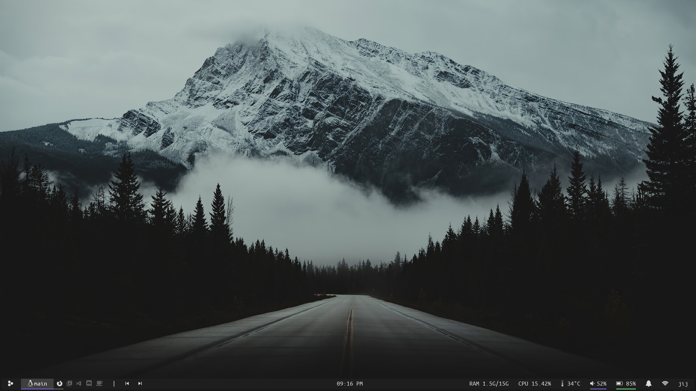
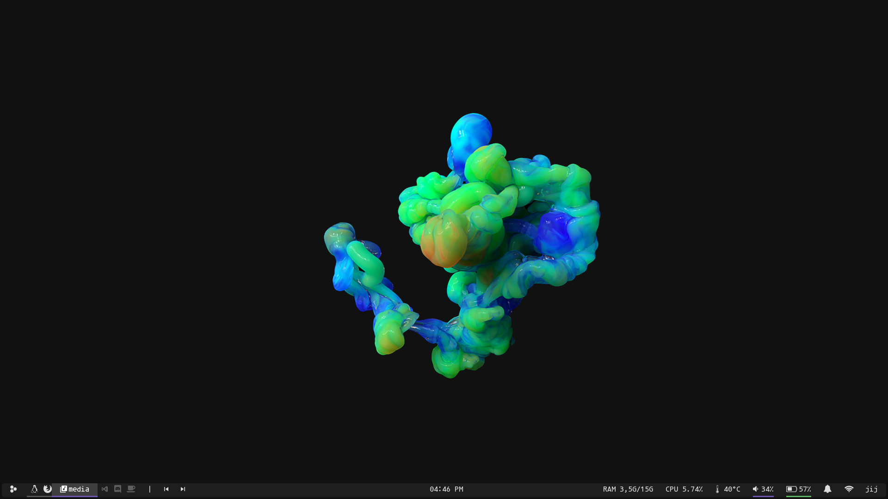

<h1 align='center'>Dotfiles</h1>

**Awesome Dots!**

Tools I use:

   ▴ **Distro** -> [Fedora "everyting"(basicX install)](https://alt.fedoraproject.org/en/)

   ▴ **WM** -> [Awesome-stable](https://awesomewm.org/)
    !:I will be switching to Debian 12 when stable
   
   ▴ **Font** -> [Agave Nerd Font](https://www.nerdfonts.com/#home)
     
   ▴ **Terminal** -> [Alacritty]
   
   ▴ **Launcher** -> [Rofi](drun mode)

   ▴ **FileManager** -> [Ranger]
   !: Maybe the gui filemanager will change from Pcmanfm to Dolphin
  
   ▴ **Doc Viewer** -> [Zathura]

awesome polybar xorg dunst rofi playerctl supergfxctl picom
vim ranger mutt zathura firefox flameshot lxpolkit materia-gtk-theme
lxappearance blueman pavucontrol alacritty zsh ffmpeg ffmpeg-libs
